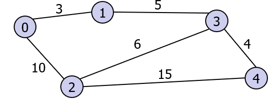
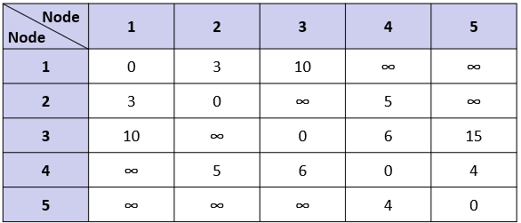

# Floyd-Warshall Algorithm

Input
-----

    N node : 5
    Distance from node 0 to node 0: 0
    Distance from node 0 to node 1: 3
    Distance from node 0 to node 2: 10
    Distance from node 0 to node 3: -
    Distance from node 0 to node 4: -
    Distance from node 1 to node 0: 3
    Distance from node 1 to node 1: 0
    Distance from node 1 to node 2: -
    Distance from node 1 to node 3: 5
    Distance from node 1 to node 4: -
    Distance from node 2 to node 0: 10
    Distance from node 2 to node 1: -
    Distance from node 2 to node 2: 0
    Distance from node 2 to node 3: 6
    Distance from node 2 to node 4: 15
    Distance from node 3 to node 0: -
    Distance from node 3 to node 1: 5
    Distance from node 3 to node 2: 6
    Distance from node 3 to node 3: 0
    Distance from node 3 to node 4: 4
    Distance from node 4 to node 0: -
    Distance from node 4 to node 1: -
    Distance from node 4 to node 2: -
    Distance from node 4 to node 3: 4
    Distance from node 4 to node 4: 0

Output
------
    Node 0 and node 1 are connected through nodes =  [0, 1] , total distance = 3
    Node 0 and node 2 are connected through nodes =  [0, 2] , total distance = 10
    Node 0 and node 3 are connected through nodes =  [0, 1, 3] , total distance = 8
    Node 0 and node 4 are connected through nodes =  [0, 1, 3, 4] , total distance = 12
    Node 1 and node 2 are connected through nodes =  [1, 3, 2] , total distance = 11
    Node 1 and node 3 are connected through nodes =  [1, 3] , total distance = 5
    Node 1 and node 4 are connected through nodes =  [1, 3, 4] , total distance = 9
    Node 2 and node 3 are connected through nodes =  [2, 3] , total distance = 6
    Node 2 and node 4 are connected through nodes =  [2, 3, 4] , total distance = 10
    Node 3 and node 4 are connected through nodes =  [3, 4] , total distance = 4

